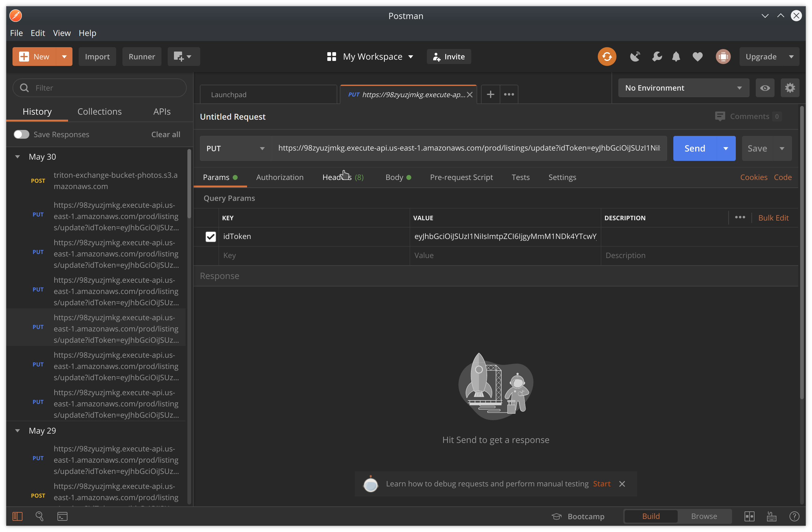

# Triton Exchange Backend

The front-end repository is located here: https://github.com/paulpan05/te-app-frontend


## CI Status

[](https://github.com/paulpan05/te-app-backend/actions)

## We are Team Pear

### Our Members

- Project Manager - Parth Shah
- Business Analyst - Dillen Padhiar
- Senior System Analyst - Neil Tengbumroong
- Software Architect - Amit Bar
- Software Development Lead - Paul Pan, Allan Tan
- Algorithm Specialist - Joachim Do
- Database Specialist - Sebastian Dogaru
- Quality Assurance Lead - Quylan Mac
- User Interface Specialist - Aarushi Shah

## Introduction

Triton exchange is a web application that us, Team Pear, developed over the course of 10 weeks. This application aims to solve the issue of the lack of centralized and trustworthy online marketplaces for UC San Diego. By making a dedicated web app that is eqipped with UCSD Single Sign-On and user ratings, we hope to provide a place where the UCSD community can feel safe when shopping. Numerous other features, like reporting listings and saving listings, makes our app more advanced and attractive than traditional school online marketplaces.

## Login Credentials

Having access to UCSD Single Sign-On should be sufficient.

## Requirements

The web application can be run on Google Chrome, Firefox, and Safari. Other browsers have not been tested and are not garanteed to work, most notably Internet Explorer.

## Installation Instruction

There is no installation needed since it is a REST API hosted on AWS Lambda.

## How to Run

You can go to https://98zyuzjmkg.execute-api.us-east-1.amazonaws.com/prod to test out the API.

Use Postman to do API requests locally.



## How to Test

- Do ```npm install``` to install dependencies for project. Make sure you have Node.js and NPM on your development environment, as well as Java.
- Copy .env.example file as .env in the same directory.
- Run ```npm start``` and go to http://localhost:8080 to test backend out, go to http://localhost:8000 to test DynamoDB.
- Run ```npm test``` for unit testing.

Sample Test Status:

```
 PASS  test/index.test.ts (7.399s)
  Full Test
    Controller Tests
      Test the root path
        ✓ Resource not found test (17ms)
      Test the listings path
        ✓ Add user test (63ms)
        ✓ Listing update (128ms)
        ✓ Listing update remove tags (164ms)
      Test the users path
        ✓ Add user test (12ms)
        ✓ Search user Paul (10ms)
        ✓ Find non-existent user (8ms)
    Data Access Object Tests
      Test the TEUsersTable
        ✓ User insertion test (10ms)
        ✓ Get user test (5ms)

Test Suites: 1 passed, 1 total
Tests:       9 passed, 9 total
Snapshots:   0 total
Time:        8.19s
Ran all test suites.
```

- Install ESLint and Prettier plugins on your Visual Studio Code to enable automatic syntax warning and correction.
- Run ```npm run lint``` to see what syntax errors you have.

Sample Lint status:
```
/home/paulpan/GitRepos/te-app-backend/src/api/listings.ts
  3:8  error  'sdf' is defined but never used  @typescript-eslint/no-unused-vars

✖ 1 problem (1 error, 0 warnings)
```

- Code will be tested and linted on GitHub prior to being automatically deployed from the master branch.

## Known Bugs

If a button is clicked twice when submitting, unexpected result can happen since two requests are made to the backend.
